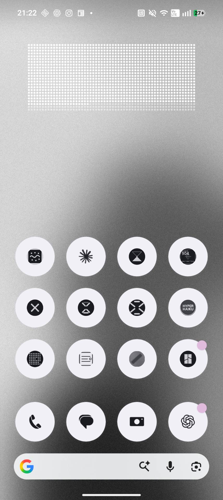

# DayGrid — 一日を正方格子に積む時計ウィジェット

横60（分）×縦24（時）の正方格子です。過ぎた1分が白い粒として積もり、
現在の一粒だけが1秒周期で点滅します。0:00になると、淡い1,440粒だけの
一日の初期状態へ戻ります。

## 仕様
- 60列×24行、各セルは正方形。グリッド全体の比率は2.5:1
- 1分＝1粒。経過時間は白、未経過時間は半透明の白、背景は透明
- 現在の一粒だけを `ViewFlipper` の2フレームで1秒ごとに点滅
- Bitmapの再描画は毎分1回。分頭に次の更新を予約
- Android 12以降のウィジェット角丸でも四隅が欠けない安全余白
- 端末再起動、アプリ更新、時刻・日付・タイムゾーン変更後に更新予約を再設定
- ウィジェットをタップすると、その場で表示を手動更新
- 正確なアラームが許可されない端末では、停止せず通常アラームへ自動的に切り替え

## インストール
配布APKをAndroid端末へダウンロードして開き、インストールします。
既存版と署名が異なる場合は、旧版をアンインストールしてから入れてください。
インストール後、ホーム画面を長押し → ウィジェット → DayGrid を配置します。

## ソースからのビルド
Android Studioで開いてRun、または：

    ./gradlew assembleDebug

## 更新について
Androidの省電力制御によって更新が遅れた場合は、ウィジェットを一度タップすると
現在時刻へ即座に追いつき、次の分更新も再予約されます。
